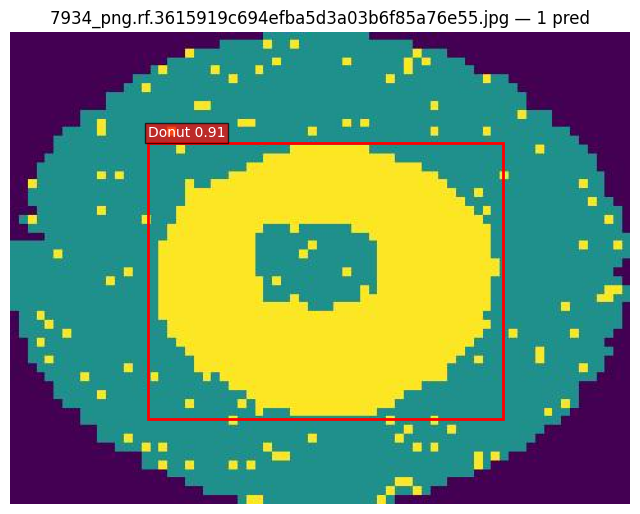
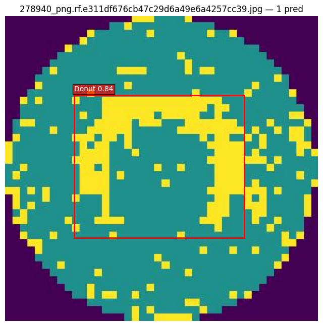
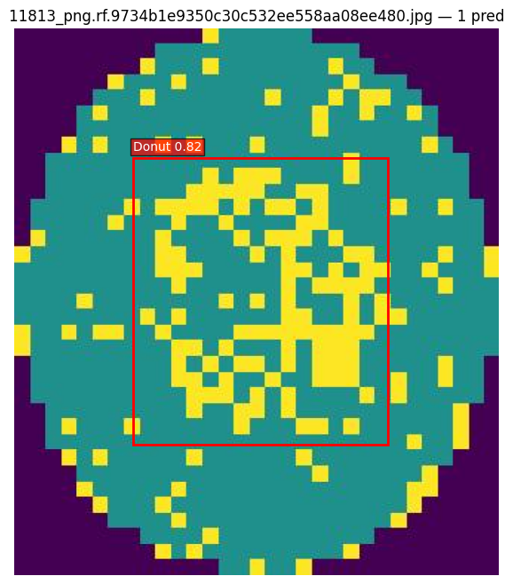
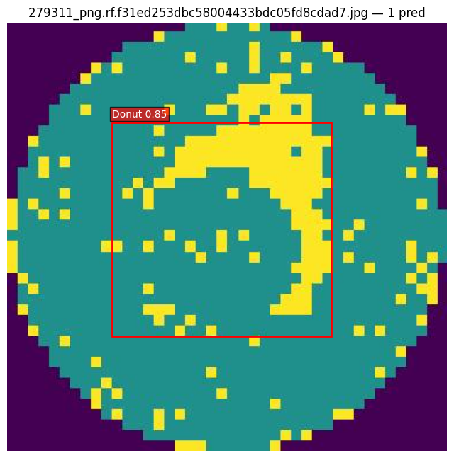
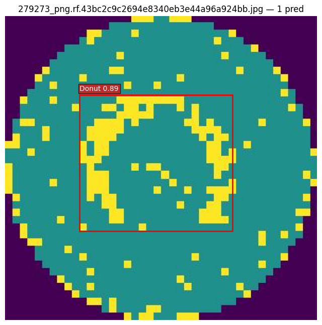
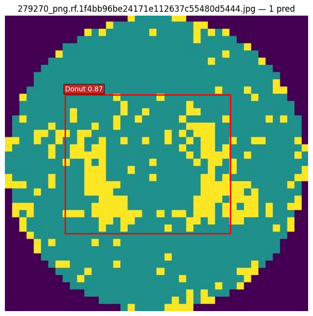
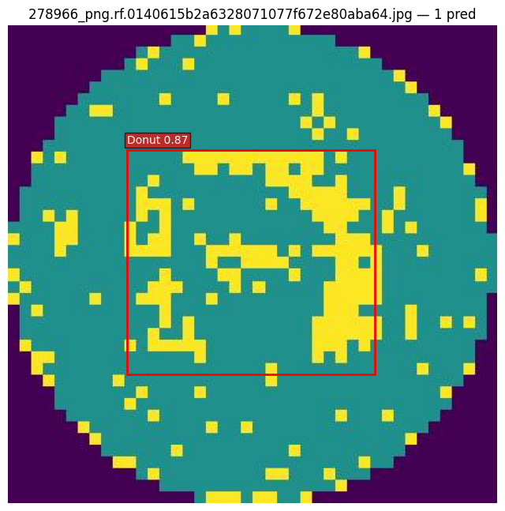
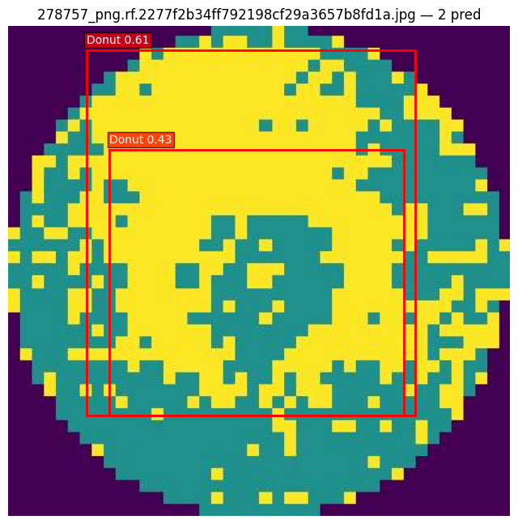
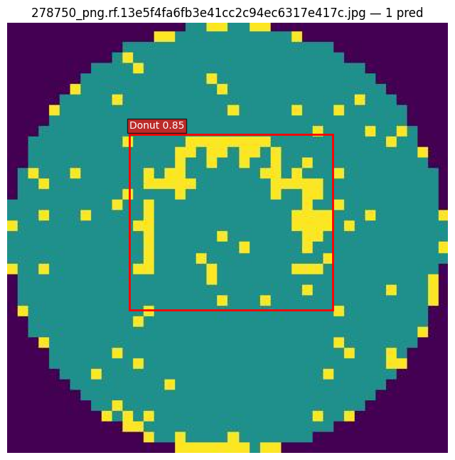
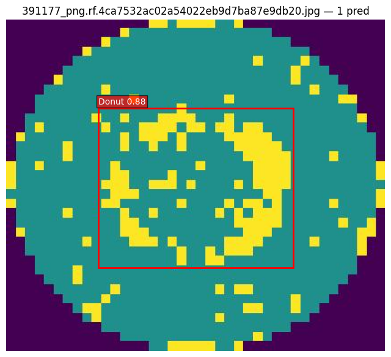

# Inference Summary — Wafer Showcase

- 範例：半導體晶圓圖瑕疵偵測（WM-811K）
- 模型：YOLOv8n（`runs/train/weights/best.pt`）
- Test set：42 張
- 裝置：Mac MPS

## Metrics (test split)

- **mAP@0.5**: 0.9913
- **mAP@0.5:0.95**: 0.7633
- **Precision**: 0.9331
- **Recall**: 0.9968

## 視覺化樣本（10 張）

## 觀察筆記

- 紅色矩形為模型預測 bbox，左上角顯示 class name 與 confidence。
- 標題顯示 `No prediction` 的圖代表模型在 conf=0.25 門檻下未輸出框。
- 若有大量漏偵測或低 confidence，可調整 config 的 `infer.conf` 門檻或重新訓練。
